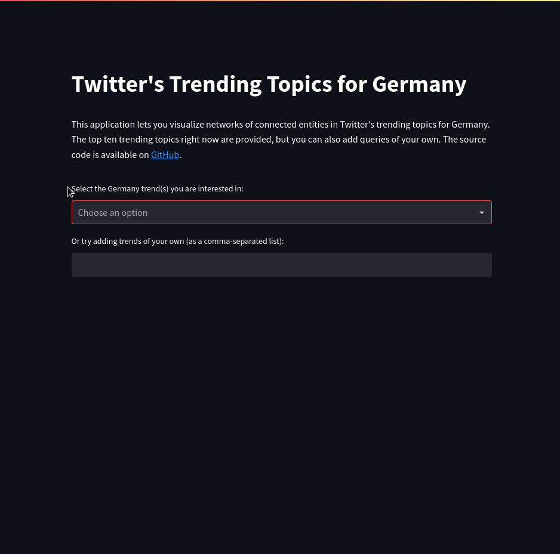

### trending-twitter-networkx-app

A simple web application that lets you visualize the connections between
entities in Twitter for any of the top 10 trending topics in Germany as well as
any other trends/topics provided as a comma-separated list.

The app was mainly created to get some hands-on experience with the Twitter API
and network visualization. It was build using Streamlit, Tweepy, NetworkX and
pyvis, and was(!) deployed with Docker on AWS Elastic Beanstalk. You can deploy
the application yourself, but you will need to have your own Twitter API
credentials, as shown in the `.env.example` file.

